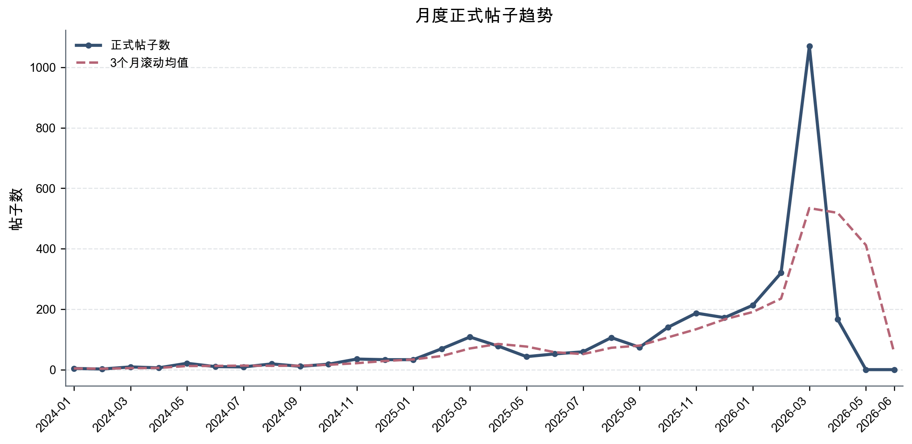
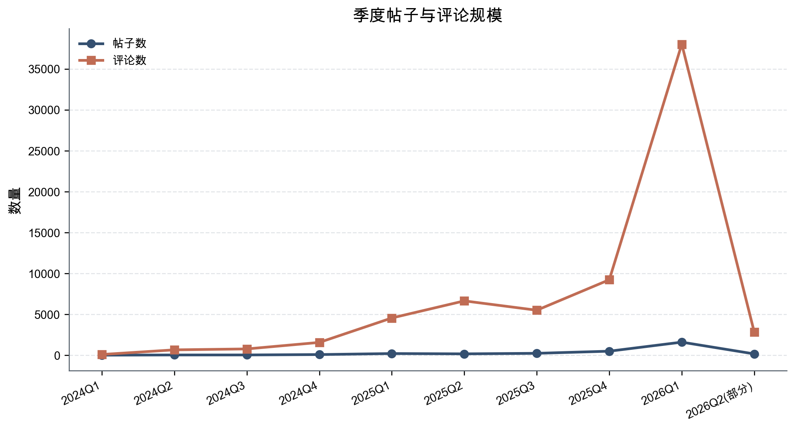
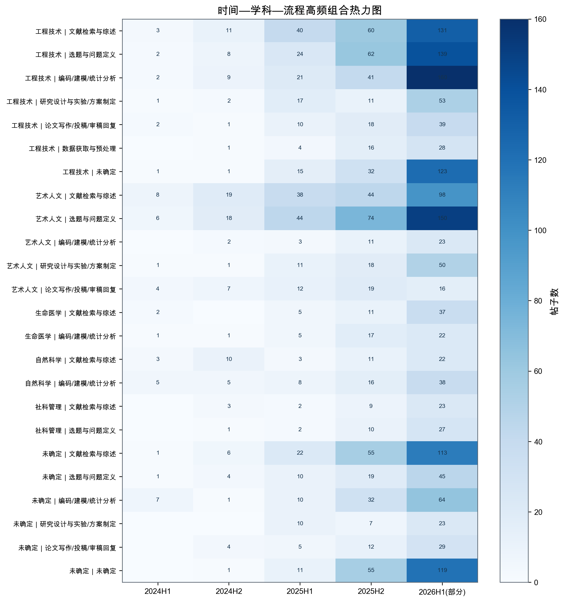
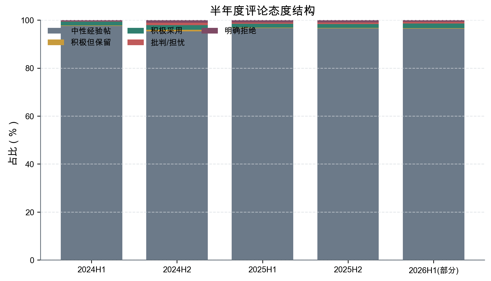
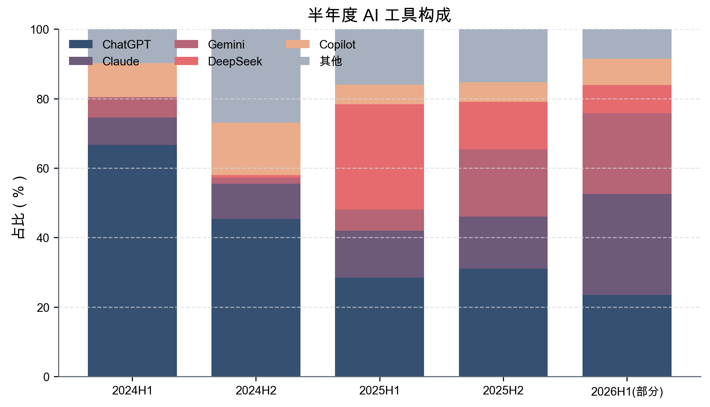
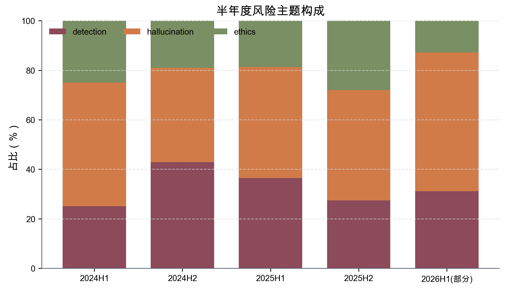

# 论文投稿版主文稿（clean）

## 摘要

**目的：** 以小红书平台为观察对象，从科研工作流环节出发，考察 AI 辅助科研（AI4S）在社交媒体中的扩散结构及其引发的差异化合法性判断。

**方法：** 本研究在 `quality_v4` 正式基线上，对 `5535` 个去重候选帖进行后编码筛选，形成 `3067` 条正式帖子和 `69880` 条正式评论，并结合两轮结构修补与评论继承审计收紧主样本边界。

**结果：** AI4S 讨论在 `2025H2` 之后显著提速，并由零散经验分享转向跨学科、多流程的常态化表达。学科分布表现为少数学科率先渗透，其中 `Engineering & Technology` 是最主要的显性入口之一；流程分布则显示，`文献检索与综述`、`选题与问题定义` 等低门槛、高可见任务首先成为 AI 介入科研的核心场景。评论区则持续围绕 `detection`、`hallucination` 等议题展开规范协商。即便在样本边界收紧后，正式样本中学科与流程仍分别有 `23.77%` 和 `14.18%` 的帖子难以被稳定归类，显示平台科研表达具有明显的经验化与情境化特征。

**结论：** AI4S 在社交媒体中的扩散并非单一的工具采纳过程，而是伴随学科差异、流程分化、风险感知与规范协商展开的社会技术过程。经边界收紧后的 `quality_v4` 样本，为解释 AI4S 的平台化扩散及其合法性争议提供了较为稳健的经验基础。

**关键词：** AI辅助科研；小红书；社交媒体；科研流程；规范协商

## 1 引言

生成式人工智能正快速进入科研实践，并持续改变研究者处理文献、界定问题、组织分析与完成写作的方式。与实验室或机构内部的工具配置不同，社交媒体使这些原本嵌入科研流程内部的使用经验转化为可见、可讨论、可争论的公共表达。由此，AI 辅助科研（AI4S）不仅是技术使用问题，也成为平台语境中的规范判断问题。小红书兼具经验分享、知识传播与互动协商等特征，为观察 AI4S 如何被日常化表达及评价提供了一个合适场域。

现有关于 AI 与科研的研究，更常从工具能力、伦理风险或单一任务场景出发讨论 AI 与科研的关系，但对社交媒体上 AI4S 的长时段扩散、学科入口差异以及不同科研环节中的合法性分化关注仍然不足。尤其在平台语境中，围绕检测、可靠性、合规性与越界风险的判断，并不只出现在发帖者的经验叙述中，还会在评论互动中被放大、修正和协商。若缺少帖子层与评论层结合的长时段证据，就难以把握 AI4S 在平台上的扩散节奏、结构分化及其边界形成过程。

基于此，本文以小红书为观察对象，在 `quality_v4` 正式基线下构建了包含 `5535` 个去重候选帖、`3067` 条正式帖子和 `69880` 条正式评论的分析样本。本文一方面从时间、学科和流程三个维度追踪 AI4S 的平台扩散结构，另一方面将评论层纳入正式分析，以识别围绕不同科研环节所形成的差异化合法性判断与边界协商。相较于仅关注帖子正文或少量案例的研究，本文试图说明，AI4S 的社会接受并不是一个整体性的“能否使用”问题，而是嵌入具体科研工作流环节的分化判断过程。

全文结构如下：第二部分说明数据来源、样本形成、结构修补与研究限制；第三部分呈现 AI4S 在平台中的扩散趋势、学科路径、流程分布、工具生态与评论区协商结构；第四部分讨论这些结果对理解 AI4S 平台化扩散及其规范边界的意义；第五部分给出结论与启示。需要说明的是，当前样本中的学科与流程仍分别有 `23.77%` 和 `14.18%` 的帖子难以被稳定归类，因此本文在细粒度比较中保持必要审慎，但这并不影响 `quality_v4` 作为当前正式论文基线的稳定性。

## 2 研究设计与方法

### 2.1 数据来源与正式基线

本研究以小红书平台为观察对象，采用“广覆盖整理、后编码筛选”的处理路径，在尽量保留原始记录的前提下构建正式分析样本。截至当前正式冻结版，数据库中共保留 `5535` 个去重候选帖，并在 `quality_v4` 口径下形成 `3067` 条正式帖子和 `69880` 条正式评论。后续论文中的主结果、图表与统计叙述均以 `quality_v4` 为唯一事实源，不再并列引用此前版本作为正式结果基线。

为保证统计口径一致，样本规模、时间分布、学科分布、流程分布、评论态度结构、工具生态与风险主题等核心结果，均已统一由研究主库正式口径复核；对应图表可在投稿版图表 manifest 中核验来源。

### 2.2 两轮结构修补与样本边界收紧

为提高主结果的结构稳定性，本研究在初步冻结之后继续进行了第二轮结构修补，并在 `quality_v3` 基础上推进到 `quality_v4`。这一轮 merged review 共覆盖 `235` 条高价值样本，其中 `223` 条实现自动回填，`0` 条进入强制人工冲突收口；与此同时，有 `194` 条帖子被回填为 `override_sample_status=false`，另有 `6` 条被识别为宣传或推广型账号。上述处理并不意味着删除原始数据，而是将边界性模板帖、泛工具清单、泛效率帖以及不再符合明确科研任务或科研流程定义的帖子移出论文主样本，同时继续在数据库与补充材料中保留原始记录，以兼顾结果边界收紧与方法透明度。

从版本变化看，这一轮边界收紧使主结果由 `quality_v3` 的 `3593` 条正式帖子、`76256` 条正式评论，调整为 `quality_v4` 的 `3067` 条正式帖子、`69880` 条正式评论；相应地，学科不确定占比从 `29.22%` 下降到 `23.77%`，流程不确定占比从 `19.43%` 下降到 `14.18%`。因此，`quality_v4` 相比上一版并非“样本更大”，而是“样本边界更清晰、结构不确定性更低”，这也是本文将其锁定为正式论文基线的主要原因。

### 2.3 评论继承审计与质量控制

在主帖结构修补完成后，本文没有对评论层逐条重新编码，而是采用“主帖回灌后评论按既有规则统一继承重算”的方式保持口径一致。为降低高风险回填对评论分析的潜在影响，研究进一步生成评论继承审计，对 `sample_status_false`、`subject_changed` 与 `workflow_changed` 三类高风险变动分别抽取代表性样本进行核查。现有审计记录共 `3` 条，覆盖三类核心变动情形。尽管审计规模有限，其主要作用在于验证第二轮结构修补并未明显破坏评论层的基本继承逻辑，从而保证评论结果继续纳入正式分析。

### 2.4 研究限制

仍需指出的是，当前版本并非没有尾部债务。就采集层而言，仍有 `queued=22`，并存在 `temporarily_unavailable_300031=43`、`needs_manual_check=5` 等平台可访问性残余问题；就媒体层而言，最新审计下 `formal_media_gap` 仍为 `2218`。此外，当前样本仍存在结构性薄弱单元格，尤其集中在 `2024H1、2024H2、2025H1` 等早期时间段，以及 `Social Sciences & Management、Life Sciences & Medicine、Natural Sciences` 等弱学科与 `学术交流与科研管理、数据获取与预处理、论文写作/投稿/审稿回复、研究设计与实验/方案制定` 等弱流程。基于这些事实，本文将媒体尾部缺口与少量抓取残余作为方法限制处理，而不再将其视为继续扩张数据主线的前提。

关于正式基线、样本形成、两轮结构修补、评论继承审计以及图表来源的更完整说明，详见附录《方法透明度与补充材料说明》。

## 3 研究结果

### 3.1 扩散趋势与时间演化

基于 `quality_v4` 正式基线，本文最终纳入正式帖子 `3067` 条、正式评论 `69880` 条。结果显示，AI4S 相关讨论在研究期内呈现出明显的加速扩散趋势。按半年度观察，正式帖子数量由 2024H1 的 52 条增至 2026H1（部分）的 1769 条，完整序列为：2024H1（52）、2024H2（125）、2025H1（383）、2025H2（738）、2026H1(部分)（1769）。与此同时，季度层面的非零“学科 × 流程”单元格也持续增加，扩散广度从 2024Q1 的 13 个活跃单元格提升至 2026Q1 的 46 个，具体表现为：2024Q1（13）、2024Q2（13）、2024Q3（16）、2024Q4（27）、2025Q1（39）、2025Q2（34）、2025Q3（37）、2025Q4（43）、2026Q1（46）、2026Q2(部分)（31）。这一变化表明，AI 在科研场景中的使用已不再停留于零散试用，而是逐渐演化为可持续、可复制的常态化平台表达。

**图1 月度正式帖子趋势。** AI4S 讨论在 2025H2 后明显提速，并在 2026H1(部分)达到当前样本内的最高活跃度。

**图2 季度帖子与评论规模。** 季度尺度进一步显示，AI4S 讨论在 2025Q4 至 2026Q1 进入显著跃升区间。

图1与图2共同表明，AI4S 的平台化扩散既体现为帖子数量的持续增长，也体现为季度尺度上活跃单元格的同步扩张。

### 3.2 学科分布与切入路径

从学科分布看，当前样本并未呈现均衡格局，而是表现为少数学科先行渗透、其余学科跟进扩散的结构。正式帖子中，Engineering & Technology（1101，35.90%）与 Arts & Humanities（700，22.82%）是最主要的显性来源，此外仍有 729 条帖子无法被稳定归入明确学科，对应 `23.77%` 的学科不确定占比。综合各学科分布，当前主要格局为：Engineering & Technology（1101，35.90%）、uncertain（729，23.77%）、Arts & Humanities（700，22.82%）、Natural Sciences（201，6.55%）、Life Sciences & Medicine（184，6.00%）、Social Sciences & Management（152，4.96%）。进一步结合高频“学科 × 流程”组合可以看到，Arts & Humanities 更集中于“选题与问题定义”，Engineering & Technology 则更多分布在“文献检索与综述”“选题与问题定义”及“编码/建模/统计分析”等可操作性较强的任务上。高频组合主要包括：Arts & Humanities×选题与问题定义（292）、Engineering & Technology×文献检索与综述（245）、Engineering & Technology×选题与问题定义（235）、Engineering & Technology×编码/建模/统计分析（233）、Arts & Humanities×文献检索与综述（207）、uncertain×文献检索与综述（197）。这意味着不同学科进入 AI4S 的入口并不一致，平台上的科研分享也因此呈现出明显的学科路径差异。

**图3 时间—学科—流程高频组合热力图。** AI4S 并未均匀进入科研全流程，而是优先在工程技术与艺术人文的高频任务环节中形成可见扩散。

图3进一步显示，平台上的高频扩散并没有平均落到所有学科与流程组合，而是集中在若干更容易被展示和复用的高频任务环节。

### 3.3 流程分布与态度分化

从流程分布看，AI4S 讨论首先集中在更容易被展示和验证的科研任务上，表现为文献检索与综述、选题与问题定义以及编码/建模/统计分析三类流程占据主体位置。当前流程结构为：文献检索与综述（790，25.76%）、选题与问题定义（697，22.73%）、编码/建模/统计分析（530，17.28%）、uncertain（435，14.18%）、研究设计与实验/方案制定（255，8.31%）、论文写作/投稿/审稿回复（200，6.52%）、数据获取与预处理（114，3.72%）、学术交流与科研管理（46，1.50%）。其中，流程不确定占比仍为 `14.18%`，说明部分平台表达依旧缺乏清晰的流程自我标识。若进一步观察态度分布，可以发现整体基调并非无条件接受，而是以“中性经验帖”和“积极但保留”为主：帖子层面，中性经验帖为 `1659` 条（`54.09%`），积极但保留为 `573` 条（`18.68%`），积极采用为 `283` 条（`9.23%`）。在细分流程上，选题与问题定义、编码/建模/统计分析以及论文写作/投稿/审稿回复的态度结构也并不一致。总体而言，越靠近可验证、可复现任务的流程，越容易形成较直接的接受；越靠近原创性或规范性较强的环节，则越容易保留审慎态度。

**图4 半年度评论态度结构。** 评论区长期以“中性经验帖”为主，但围绕风险和边界的规范协商始终持续存在。

图4表明，平台互动整体以中性经验分享为主，但规范性焦虑并未消失，而是持续嵌入对具体科研流程的态度判断之中。

### 3.4 工具生态与评论区规范协商

工具生态与风险主题的统计显示，AI4S 已由围绕单一明星工具的尝试，转向多模型并存、按任务切换的使用格局。分半年度看，高频工具组合依次为：2024H1：ChatGPT（34）、Copilot（5）、Claude（4）、Gemini（3）；2024H2：ChatGPT（54）、Copilot（18）、Claude（12）、Kimi（12）；2025H1：DeepSeek（125）、ChatGPT（117）、Claude（56）、Gemini（25）；2025H2：ChatGPT（150）、Gemini（94）、Claude（72）、DeepSeek（66）；2026H1：Claude（388）、ChatGPT（315）、Gemini（311）、DeepSeek（110）。分学科看，Engineering & Technology 更偏好 ChatGPT（233）、Claude（197）、Gemini（125）、DeepSeek（84），Arts & Humanities 更偏好 ChatGPT（196）、Claude（186）、Gemini（113）、DeepSeek（93），Life Sciences & Medicine 则更集中于 Gemini（53）、ChatGPT（28）、Claude（18）、DeepSeek（15）。这说明不同学科并非共享同一套工具栈，而是在形成具有任务导向和学科特征的工具配置模式。

与此同时，评论区承担了明显的规范协商功能。正式评论中，中性经验帖达到 `67392` 条，占比 `96.44%`；但在风险主题上，`detection`（`649`）与 `hallucination`（`525`）在评论层的权重明显高于正文。评论争议类型中，明确风险争议评论为 `1159` 条，而无明确争议标记的评论为 `68721` 条。这表明平台互动的核心焦点并不在于“AI 是否可用”，而更集中于“AI 如何使用才算合规、可靠与可接受”。

**图5 半年度 AI 工具构成。** 工具生态已从早期围绕单一工具的尝试，转向多模型并存、按任务切换的构成格局。

**图6 半年度风险主题构成。** 风险讨论并非平均分布，而是逐步集中到 detection 与 hallucination 等规范敏感议题上。

图5和图6共同说明，AI4S 的平台化扩散并不是简单围绕单一工具展开，而是在多模型并存的工具生态中，与 detection、hallucination 等规范敏感议题同步升温。

### 3.5 结果小结

综合以上结果可以看到，`quality_v4` 口径下的 AI4S 讨论已经表现出清晰的时间扩散轨迹、显著的学科入口差异以及围绕具体科研流程展开的态度分化。更重要的是，第二轮结构修补收紧了主样本边界，使当前结果更集中反映“明确科研任务/流程”语境中的平台表达，而不再混入大量边界性工具帖或泛效率帖。在此基础上，高比例的不确定项仍提示我们对三维比较保持解释审慎，但就整体结果而言，当前样本已足以支持对 AI4S 平台扩散、工具生态与规范协商的正式分析。

## 4 讨论

本研究基于小红书平台 `3067` 条正式帖子和 `69880` 条正式评论，对 AI4S 在社交媒体中的扩散与争议进行了分层观察。相较于将 AI 科研使用理解为单一态度问题，当前结果更清楚地表明：AI4S 的平台化扩散，是一个以科研工作流为组织单位、以差异化合法性判断为评价机制、以评论互动为边界协商场的社会技术过程。

### 4.1 AI4S 的平台扩散首先表现为工作流化，而非一般化

从时间序列看，AI4S 已由零散试用转向常态化表达，但更值得注意的是，这种扩张并非简单的讨论增量，而是沿着科研工作流逐步“落位”。最早被广泛谈论的并不是科研整体，而是文献检索、选题、编码分析等更容易被拆解、展示和复用的任务环节。这说明，平台上的 AI4S 扩散首先表现为工作流化：研究者并不是抽象地讨论“是否使用 AI”，而是在具体任务中界定 AI 能做什么、适合做什么以及做到什么程度。

### 4.2 合法性判断具有明显的环节差异

进一步看，合法性判断并不围绕 AI 本身展开，而是围绕 AI 所进入的科研环节展开。越接近可标准化、可验证、可复制的任务，平台讨论越容易给出相对积极的接受；越接近原创性、责任归属和学术能力边界，评价就越趋审慎。工程技术与人文艺术在高频入口上的差异也表明，所谓“AI4S 的合法性”并不是一个统一标准，而是受到学科任务结构、表达习惯与规范期待共同塑形的差异化判断。

### 4.3 评论区构成边界协商的关键场域

帖子层与评论层的差异说明，评论区并不是对帖子内容的简单补充，而是合法性判断被放大和细化的关键场域。帖子更常呈现“如何使用 AI”的经验叙述，评论则更频繁追问“这样使用是否可靠、是否会被识别、是否已经越界”。`detection` 与 `hallucination` 在评论层的持续高权重，表明平台用户真正协商的重点并不只是效率收益，而是可接受辅助与不可接受替代之间的边界。由此看，评论层应被视为解释 AI4S 社会接受过程的必要证据，而不是正文分析的附属部分。

### 4.4 不确定性既是方法约束，也是平台表达方式的一部分

当前正式帖子中仍有 `23.77%` 的学科不确定项和 `14.18%` 的流程不确定项，这当然要求我们在细粒度比较中保持谨慎，但这种不确定性并不只是编码残差。更重要的是，它反映出小红书上的科研表达常以经验片段、问题情境和操作心得的方式出现，而不总是按照标准学科和标准流程自我命名。换言之，平台上的 AI4S 讨论天然带有经验化、碎片化和情境化特征。这既构成方法约束，也恰恰是本文理解平台科研表达的重要发现。

### 4.5 研究启示与后续边界

对后续研究与实践而言，当前结果至少提供三点启示。其一，对 AI4S 的研究需要从“是否使用 AI”转向“AI 进入了哪些科研环节、以何种方式被接受或质疑”。其二，对平台治理、科研训练和工具设计而言，更值得回应的并不是抽象的支持或反对，而是不同流程中的检测焦虑、幻觉风险、责任归属与训练价值问题。其三，当前 `quality_v4` 已足以支撑正式论文写作，但早期时间段、弱学科和弱流程仍是后续补强的重点；是否重新打开数据主线，应以这些薄弱单元格是否实质影响解释力为标准，而不应再以样本规模扩张本身为目标。

## 5 结论与启示

本文在 `2024-01-01` 至 `2026-06-30` 的研究窗口内整理小红书公开讨论，并以当前正式覆盖截止日 `2026-04-10` 形成包含 `5535` 个去重候选帖、`3067` 条正式帖子和 `69880` 条正式评论的 AI4S 研究样本。研究表明，AI4S 在社交媒体上的扩散已经从早期零散试用转向跨学科、多流程并存的常态化表达，但这种扩散并不是均匀展开的，而是沿着具体科研工作流环节逐步渗透。

第一，AI4S 的平台化扩散具有明显的流程性与学科路径差异，文献检索、选题与编码分析等更易展示、复用和验证的任务率先成为高频入口。第二，合法性判断具有鲜明的环节差异，越靠近原创性、责任归属与学术能力边界的任务，平台评价越趋审慎。第三，评论区不是经验帖的附属空间，而是围绕检测、幻觉、可靠性与越界风险展开边界协商的关键场域。

由此可见，AI4S 的社会接受并非一个抽象的“能不能用”问题，而是一个嵌入具体科研环节、在平台互动中被持续区分、评估与协商的动态过程。对研究而言，这提示我们应以“工作流环节—合法性评价—边界协商”为线索理解 AI4S 的平台化扩散；对实践而言，则需要围绕不同科研流程建立更细致的使用规范与训练要求。

本文的局限在于，平台样本仍存在结构性薄弱单元格，且学科与流程的不确定占比仍分别为 `23.77%` 和 `14.18%`。因此，后续研究仍需围绕高价值不确定样本、弱学科与弱流程开展定点补强，并进一步提高对合法性判断与边界协商机制的解释稳定性。但就当前阶段而言，`quality_v4` 已足以支撑论文成稿与正式讨论。

与样本形成、边界收紧、评论继承审计和图表来源相关的补充说明，见附录《方法透明度与补充材料说明》。
